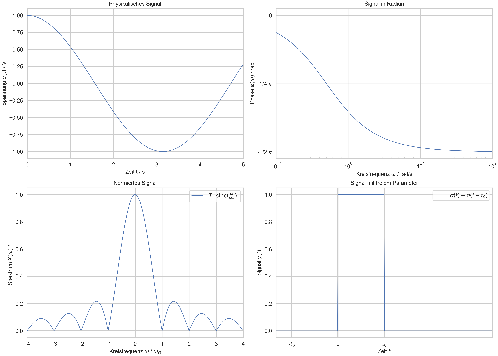
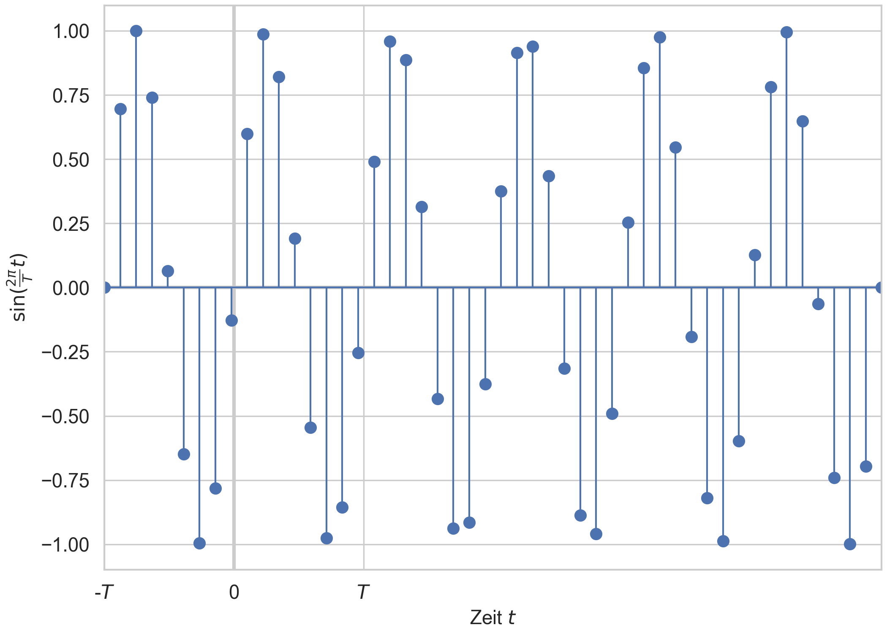
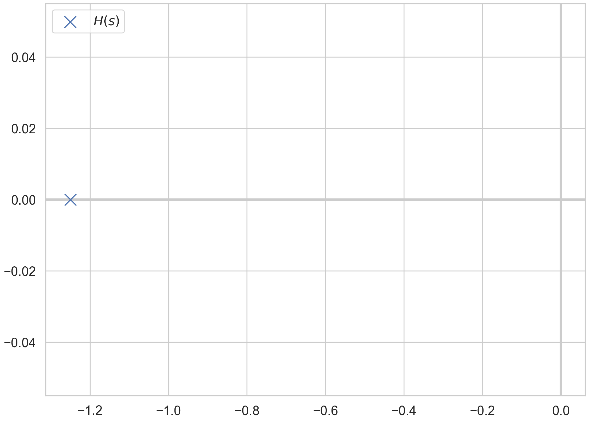
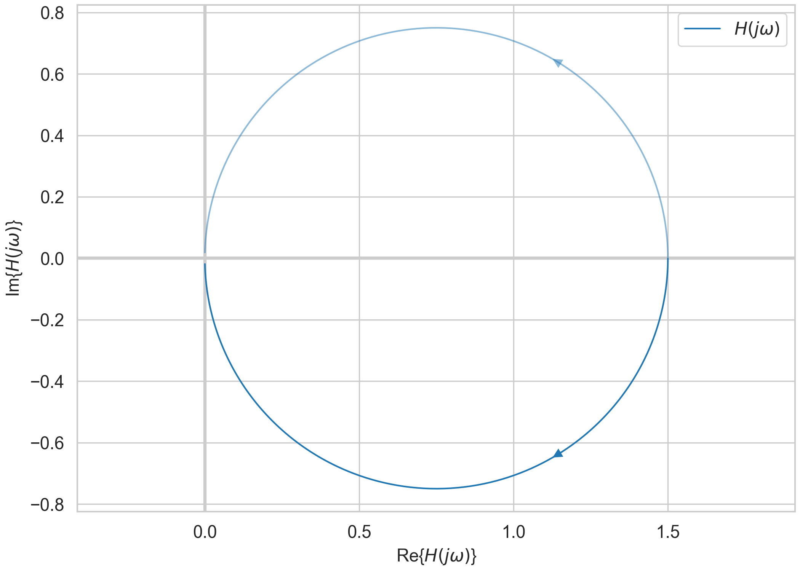

# sysplot

Centralized plotting utilities for reproducible, publication-quality figures in system theory and control engineering.

## Features

- **Consistent figure sizing** — Automatically compute figure dimensions for single and multi-subplot layouts
- **Global style management** — Apply color and line styles uniformly across plots
- **Control-theory visualizations** — Specialized plotters for Bode diagrams, Nyquist plots, and pole-zero maps
- **Axis helpers** — Highlight axes, set symmetric limits, and configure custom tick labels
- **Configurable output** — Save figures with automatic filename generation and language support (English/German)

## Installation

Install from PyPI:

```bash
pip install sysplot
```

Or install in editable mode with development dependencies:

```bash
git clone https://github.com/JaxRaffnix/sysplot.git
cd sysplot
pip install -e .[dev]
```

## Quick start

```python
import numpy as np
import matplotlib.pyplot as plt
import sysplot as ssp

# Create a figure with automatic sizing
fig, ax = plt.subplots(figsize=ssp.get_figsize(nrows=1, ncols=1))
ssp.highlight_axes(fig)

# Apply consistent styling
x = np.linspace(0, 10, 100)
for i in range(3):
    y = np.sin(x + i * np.pi / 3)
    ax.plot(x, y, **ssp.get_style(i), label=f"Signal {i+1}")

ax.set_xlabel("Time [s]")
ax.set_ylabel("Amplitude")
ax.legend()

# Save the figure
ssp.save_current_figure(chapter=1, number=1, folder="figures")
plt.show()
```

### Example outputs







## Documentation

See the [docs](https://jaxraffnix.github.io/sysplot) for detailed usage instructions, API reference, and examples.


## Contributing

See [CONTRIBUTING.md](CONTRIBUTING.md) for guidelines on setup, testing, and submitting changes.

## License

MIT License – see [LICENSE](LICENSE) for details.
