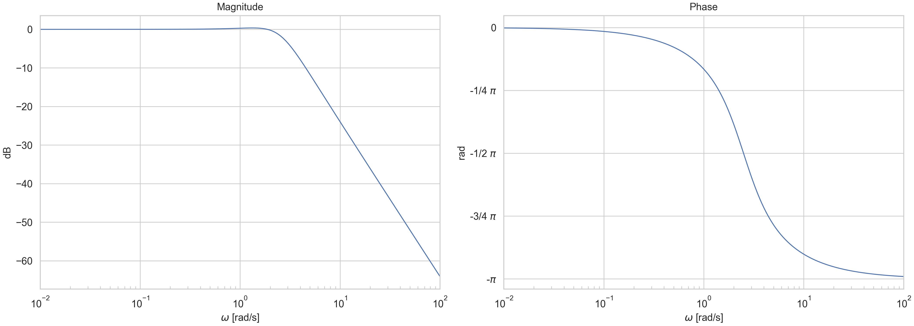

<p align="center">
  
</p>

# Sysplot

Sysplot provides centralized plotting utilities for reproducible,
publication-quality figures in system theory and control engineering.

It extends Matplotlib with consistent figure styling, configuration management,
specialized helpers for annotating and improving visual clarity, and
high-level plotting functions for Bode plots, Nyquist diagrams, and pole-zero maps.

The project documentation is available on GitHub: https://jaxraffnix.github.io/sysplot.

## Installation

Sysplot is available on PyPI. Python 3.9 or higher is required.

```bash
uv add sysplot
```

Or with pip:

```bash
pip install sysplot
```

## Minimum Example

A single call to `sysplot.plot_bode()` with magnitude, phase, and frequency data produces:

* a Bode plot consisting of two subplots
* phase unwrapped in multiples of $2\pi$
* phase tick labels displayed as fractional multiples of $\frac{\pi}{2}$
* magnitude displayed in dB
* logarithmic frequency axis
* minor ticks at every decade of the frequency axis
* consistent figure styling based on a configurable seaborn-derived theme

```python
import numpy as np
import matplotlib.pyplot as plt
import control as ctrl
import sysplot as ssp

# apply default configuration 
ssp.apply_config() 

# Generate frequency response
omega = np.logspace(-2, 2, 300)
system = ctrl.tf([6.25], [1, 3 , 6.25])
mag, phase, _ = ctrl.frequency_response(system, omega)

# Create Bode plot
fig, axes = plt.subplots(1, 2, figsize=ssp.get_figsize(1, 2))

# ** sysplot is used here **
ssp.plot_bode(mag, phase, omega, axes=axes)

# Labels
axes[0].set(title="Magnitude", xlabel=r"$\omega$ [rad/s]", ylabel="dB")
axes[1].set(title="Phase", xlabel=r"$\omega$ [rad/s]", ylabel="rad")
plt.show()
```



## Features

See the [quick start example](docs/examples/quick_start.py) for an overiew of the features.

## Contributing

See [CONTRIBUTING](CONTRIBUTING.md) for dev setup, code requirements, and contribution guidelines.

## License

MIT License – see [LICENSE](LICENSE) for details.

## Ideas / To Do

- there is still an issue with plot_pole_zero with no linestyle not upadting the cycler index
- maybe add default arrow with text plotter? default linewidth, arrow size, ...
- publish to pypi
- automatically link gallery examples from function reference
- update install guide. test with laptop.
- update, improve, synchronize the intro in readme, init, index files.
- update contributing guide with more detailed instructions for testing, documentation, and code style.
- explain the syspot features in the examples. phase in pi/2, mirrores nyquist, arrows, markers for pole and zero, ....

# copilot promt

for my function: plot_angle()

use google style docstring. improve docstring. improve parameter types. add necessary input validation. 
dont list the raised expections in the docstring.s
if a default argument is reponsible for the asthetics of the plot, then it should have a default value in `SysplotConfig`. the function parameter should be default None and be loaded from the config inside the function body.
creaate a file in docs\examples to show the usage of this function. Dont have a code examples in the docstring. for examples, use `import sysplot as ssp`.
the example in docs/examples must have a gallery example docstring in the beginning of the file. there, explain waht the called sysplot function does and its features.
the example should be refeenrec in the docstring with
.. minigallery:: sysplot.bode
  :add-heading: