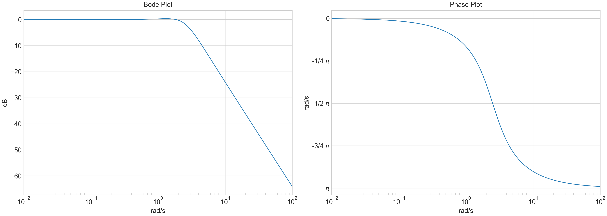

Sysplot documentation
=====================

Sysplot provides centralized plotting utilities for reproducible,
publication-quality figures in system theory and control engineering.

It extends Matplotlib with consistent figure styling, configuration management,
specialized helpers for annotating and improving visual clarity, and
high-level plotting functions for Bode plots, Nyquist diagrams, and pole-zero maps.

The project source code and documentation are available on GitHub: `<https://github.com/JaxRaffnix/sysplot>`_.

Example
---------

A single call to :func:`sysplot.plot_bode` with magnitude, phase, and frequency data produces:

* a Bode plot consisting of two subplots
* phase unwrapped in multiples of :math:`2\pi`
* phase tick labels displayed as fractional multiples of :math:`\pi/2`
* magnitude displayed in dB
* logarithmic frequency axis
* minor ticks at every decade of the frequency axis
* consistent figure styling based on a configurable seaborn-derived theme

Why this package exists
------------------------

Sysplot originated from work at Hochschule Karlsruhe, where the
diagrams used in the lecture *System and Signal Theory* were revised.

A central requirement was that all figures should share a *consistent
visual style* and meet a *high publication standard*. To achieve this,
a global configuration system was introduced to control styling,
figure dimensions, and export behavior.

Because many diagrams appear repeatedly in the lecture material,
common plotting tasks were automated. Additional utilities were created
to improve the visual clarity of figures, such as

- highlighting important axis lines
- placing custom axis tick labels 
- emphasizing reference elements such as the unit circle

Contents
--------

.. toctree::
   :maxdepth: 2

   installing
   _auto_examples/index
   concepts
   api

Indices and Tables
-------------------

* :ref:`genindex`
* :ref:`modindex`
* :ref:`search`