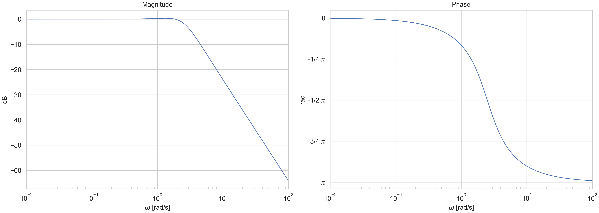

Getting started
=====================

Install sysplot
--------------

sysplot is available on PyPI and can be installed using pip:

.. code-block:: bash

   pip install sysplot

Alternatively, if you have already cloned the repository and want to use it inside another repository, you can install it in development mode:

.. code-block:: bash

   pip install -e relative//path/to/sysplot

Quick Start
--------------

After installing, you can import sysplot in your Python code and start using it to create various types of plots for control systems analysis. For example, you can run the minimum example script:

.. literalinclude:: examples/minimum_example.py
   :language: python
   :caption: Minimum sysplot example

which produces the following figure:

